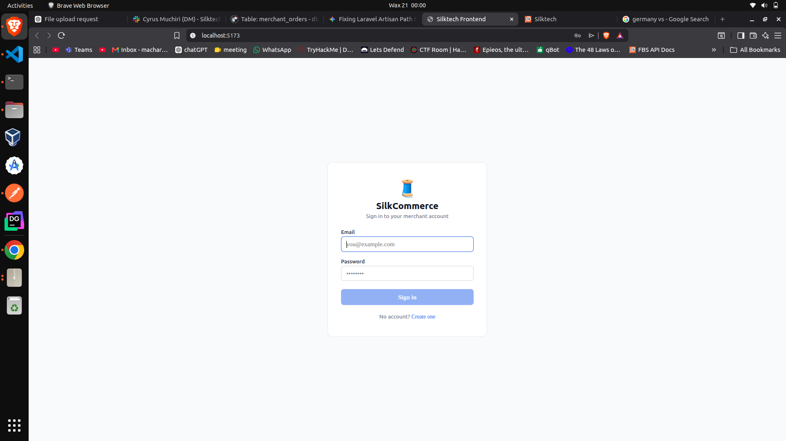
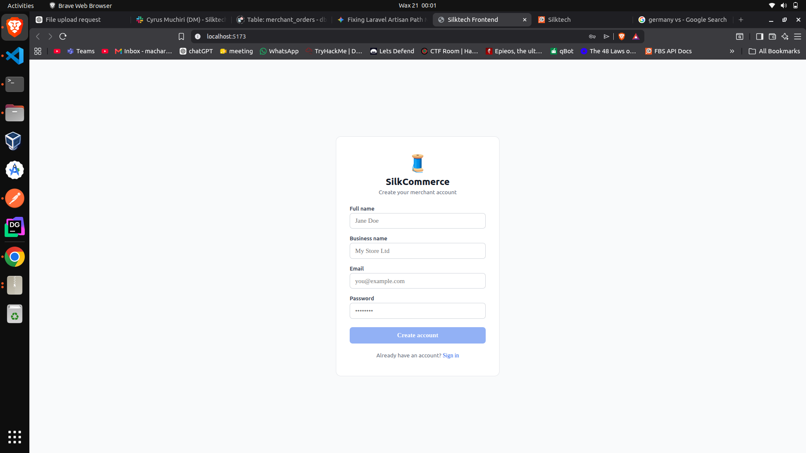
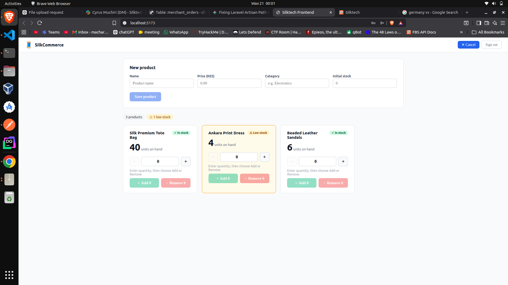
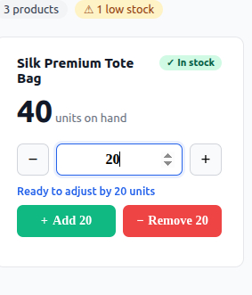

# Silktech Full-Stack Assessment — Submission

**Stack:** PHP 8.1+ / Laravel 10, MySQL, Vue 3 (Composition API), Vitest
**Deployment:** Docker Compose

---

## Table of Contents

1. [Docker Setup](#docker-setup)
2. [Quick Start](#quick-start)
3. [API Documentation](#api-documentation)
4. [Part 1 — Idempotent Payment Webhook](#part-1--idempotent-payment-webhook)
5. [Part 2 — Merchant Product API](#part-2--merchant-product-api)
6. [Part 3 — SQL & Debugging](#part-3--sql--debugging)
7. [Part 4 — Vue.js Stock Widget](#part-4--vuejs-stock-widget)
8. [Part 5 — Short Answers](#part-5--short-answers)
9. [Database Schema](#database-schema)
10. [Assumptions](#assumptions)

---

## Docker Setup

All services run in Docker Compose. No local PHP, Node, or MySQL installation needed.

### Services

**1. `app` — Laravel Backend**
- **Image:** Custom built from `laravel/Dockerfile`
- **Port:** `8000` (maps to host `8000`)
- **Purpose:** Runs `php artisan serve` automatically on startup, serving the REST API
- **Volume:** Mounts `./laravel` directory for live code reloading
- **Network:** Connected to `silktech-network` for inter-service communication

**2. `db` — MySQL Database**
- **Image:** `mysql:8.0` (official MySQL)
- **Port:** `3306` (maps to host `3306`)
- **Purpose:** Persistent data storage for merchants, products, orders, payments
- **Credentials:** `root` / `root` (configured in `.env`)
- **Volume:** `silktech-dbdata` persists data across container restarts
- **Network:** Connected to `silktech-network` so the `app` container can reach it

**3. `db-test` — MySQL Test Database**
- **Image:** `mysql:8.0` (official MySQL)
- **Port:** `3307` (maps to host `3307`)
- **Purpose:** Isolated database for running PHPUnit tests — dev data never touched
- **Credentials:** `root` / `root` (configured in `.env.testing`)
- **Network:** Connected to `silktech-network` so the `app` container can reach it

**4. `adminer` — Database Management UI**
- **Image:** `adminer:latest` (lightweight DB admin tool)
- **Port:** `8080` (maps to host `8080`)
- **Purpose:** Visual database browser — useful for inspecting tables, running manual queries, testing without CLI
- **URL:** `http://localhost:8080` → Login: `MySQL` server `db:3306`, user `root`, password `root`
- **Network:** Connected to `silktech-network`

### Network & Volumes

- **`silktech-network`:** Bridge network allowing `app`, `db`, and `adminer` to communicate by hostname
  - `app` connects to `db` via `DB_HOST=db` (hostname resolution)
  - `adminer` connects to `db` via hostname `db`

- **`silktech-dbdata`:** Named volume that persists MySQL data across container lifecycles
  - `docker compose down` does NOT delete this volume
  - `docker compose down -v` deletes it (full reset)

---

## Quick Start

### First time setup

```bash
# 1. Build and start all services
docker compose up -d

# 2. Wait ~5 seconds for MySQL to be ready
sleep 5

# 3. Install Laravel dependencies
docker compose exec app composer install

# 4. Copy .env and generate app key
docker compose exec app cp .env.example .env
docker compose exec app php artisan key:generate

# 5. Run migrations
docker compose exec app php artisan migrate

# 6. Seed demo data
docker compose exec app php artisan db:seed

# 7. Run tests (optional)
docker compose exec app php artisan test
```

### Start/Stop

```bash
docker compose up -d      # Start all services (background)
docker compose down        # Stop all services (keep data)
docker compose down -v     # Stop and delete all volumes (full reset)
docker compose logs -f app # Tail Laravel logs
```

### Access Services

| Service | URL | Credentials |
|---------|-----|-------------|
| Laravel API | `http://localhost:8000` | See `.env` |
| Adminer DB UI | `http://localhost:8080` | root / root |
| Vue Dev Server | `http://localhost:5173` | (separate npm command) |

### Run Commands Inside Container

```bash
docker compose exec app php artisan tinker     # Laravel shell
docker compose exec app php artisan migrate    # Run migrations
docker compose exec app php artisan test       # Run tests
docker compose exec db mysql -uroot -proot     # MySQL CLI
```

---

## API Documentation

Full interactive API documentation (Postman):
**https://documenter.getpostman.com/view/55427973/2sBXwvJooR**

### Endpoints at a glance

| Method | Endpoint | Auth | Description |
|--------|----------|------|-------------|
| `POST` | `/api/register` | — | Create merchant account |
| `POST` | `/api/login` | — | Login, returns Bearer token |
| `POST` | `/api/logout` | Bearer | Revoke token |
| `GET` | `/api/products` | Bearer | Paginated product list |
| `POST` | `/api/products` | Bearer | Create product |
| `PATCH` | `/api/products/{id}/stock` | Bearer | Adjust stock by delta |
| `POST` | `/api/webhooks/payment` | Signature | Payment callback handler |

### Authentication

All product endpoints require the `Authorization: Bearer {token}` header. Obtain the token from `/api/login` or `/api/register`. Without it, the API returns:

```json
{ "message": "You need to log in." }
```

### Register — `POST /api/register`

**Request body:**
```json
{
  "name": "test user",
  "business_name": "test business",
  "email": "test@silktech.com",
  "password": "password123"
}
```

**Success `201`:**
```json
{
  "access_token": "4|VKAFn9BuNrZvkeK364k76sNhrzoKFtXaMcjZEwze75b2209b",
  "token_type": "Bearer",
  "merchant": {
    "id": 5,
    "name": "test user",
    "business_name": "test business",
    "email": "test@silktech.com"
  }
}
```

**Error `422` (validation):**
```json
{
  "message": "Validation failed.",
  "errors": {
    "email": ["The email has already been taken."]
  }
}
```

### Login — `POST /api/login`

**Request body:**
```json
{
  "email": "admin@silktech.com",
  "password": "password123"
}
```

**Success `200`:**
```json
{
  "access_token": "2|YcTZF684ynmCQaapLSiaXwY2TrjG9B0pkU5aDnesaa92e347",
  "token_type": "Bearer"
}
```

**Error `401` (wrong credentials):**
```json
{ "message": "Invalid credentials." }
```

### Logout — `POST /api/logout`

Include the Bearer token in the `Authorization` header. Clears the token server-side. The Vue app also removes it from `localStorage` immediately.

### Get Products — `GET /api/products`

Returns paginated list scoped to the authenticated merchant. Supports `?page=N`.

**Response `200`:**
```json
{
  "current_page": 1,
  "data": [
    {
      "id": 3,
      "merchant_id": 1,
      "name": "Mach",
      "price": "99.99",
      "category": "Electronics",
      "stock_quantity": 50,
      "created_at": "2026-06-20T01:08:32.000000Z",
      "updated_at": "2026-06-20T01:08:32.000000Z",
      "deleted_at": null
    }
  ],
  "last_page": 1,
  "per_page": 20,
  "total": 1
}
```

### Create Product — `POST /api/products`

**Request body:**
```json
{
  "name": "Mach",
  "price": 99.99,
  "category": "Electronics",
  "stock_quantity": 50
}
```

**Success `201`:**
```json
{
  "id": 3,
  "merchant_id": 1,
  "name": "Mach",
  "price": "99.99",
  "category": "Electronics",
  "stock_quantity": 50,
  "created_at": "2026-06-20T01:08:32.000000Z",
  "updated_at": "2026-06-20T01:08:32.000000Z"
}
```

### Adjust Stock — `PATCH /api/products/{id}/stock`

**Request body:**
```json
{ "delta": 10 }
```

Use a positive number to add stock (`10`), negative to remove (`-5`). The API rejects any delta that would take stock below zero.

**Success `200`:**
```json
{
  "id": 3,
  "name": "Mach",
  "stock_quantity": 60
}
```

**Error `422` (insufficient stock):**
```json
{ "message": "Insufficient stock. Current: 3, adjustment: -10." }
```

---

## Part 1 — Idempotent Payment Webhook

### Idempotency strategy

Two layers of protection work together:

1. **Application check (fast path):** Before opening a transaction, we check whether `payments.transaction_id` already exists. If it does, return `200` immediately — no DB write, no lock contention.

2. **DB unique constraint + `lockForUpdate` (race condition path):** Two simultaneous duplicate deliveries can both pass the application check in the same millisecond. Inside the DB transaction, `lockForUpdate()` on the order row serialises concurrent updates. The `UNIQUE` constraint on `payments.transaction_id` catches the second inserter and raises a `UniqueConstraintViolationException`, which we convert to a `200` response.

### Race condition — two retries at the same instant

Both pass the initial check simultaneously. Both attempt `INSERT INTO payments`. The DB unique constraint lets only one succeed. The loser gets a `UniqueConstraintViolation` exception — caught and returned as `200 Already processed (concurrent)`. No duplicate row, no double order update.

### Unknown or already-paid order

- **Order not found:** Return `422` — tells the provider the payload is bad, stop retrying. No payment row is created (nothing to attach it to).
- **Amount mismatch:** Return `422` with `expected` and `received` fields — prevents partial payments being accepted as settled.
- **Order already paid by a different transaction:** Return `422` — second completed payment for same order is rejected outright. No extra row written.

### `failed` or `reversed` arriving after `completed`

Payment events are persisted for audit. A `reversed` event on a paid order flags it as `pending_refund` for ops review — we never auto-refund, that has accounting side effects that deserve their own workflow.

### Webhook Request Fields

| Field | Description |
|-------|-------------|
| `provider` | Payment network: `mpesa`, `airtel`, `stripe`, etc. |
| `transaction_id` | Provider's unique ID — the idempotency key |
| `order_reference` | Links to `merchant_orders.order_reference` |
| `amount` | Must exactly match `merchant_orders.total_amount` |
| `currency` | ISO 4217 code (e.g. `KES`) |
| `msisdn` | Payer's phone number (M-Pesa specific, nullable) |
| `status` | One of `completed`, `failed`, `reversed` |
| `occurred_at` | ISO 8601 timestamp of the payment event |

### Response Codes

| Status | Scenario |
|--------|----------|
| `200 OK` | Duplicate — already processed, no action taken |
| `201 Created` | New payment processed, order updated to `paid` |
| `422 Unprocessable` | Bad reference, amount mismatch, or order already paid |
| `500 Internal Server Error` | DB failure — provider should retry |

### Testing the Webhook Locally

**Webhooks cannot be sent to `localhost`** because payment providers (M-Pesa, Airtel, Stripe, etc.) are remote services that cannot reach your local machine. The webhook URL must be a publicly accessible HTTPS endpoint.

**Option 1: ngrok (Recommended for Development)**

ngrok creates a public HTTPS tunnel to your local Docker container, allowing remote payment providers to send webhooks to your development machine.

```bash
# 1. Download ngrok: https://ngrok.com/download
# 2. Start ngrok tunnel (in a new terminal)
./ngrok http 8000

# Output:
# Forwarding   https://abc123.ngrok.io -> http://localhost:8000
```

Register the HTTPS URL with the payment provider:
```
https://abc123.ngrok.io/api/webhooks/payment
```

Open ngrok dashboard at `http://127.0.0.1:4040` to see every request, response, headers, and payload in real-time.

**Important notes:**
- Every time you restart ngrok, you get a new URL (unless you have a paid account with fixed URLs)
- ngrok is for development only — for production, use the actual domain
- Payment providers may have IP whitelisting — ngrok uses shared IP addresses

**Option 2: Staging Server**

Deploy to a staging server with a real domain and test with actual payment provider test credentials.

### Idempotency Testing (Postman)

1. `POST` the sample payload → expect `201`, order is `paid`
2. `POST` the exact same payload again → expect `200 Already processed`
3. Change `transaction_id`, keep everything else → expect `422 Order already paid`
4. Use Postman **Collection Runner** with 5 concurrent requests to prove only 1 payment row is created

---

## Part 2 — Merchant Product API

The product API is fully documented in the [API Documentation](#api-documentation) section above. Key implementation decisions:

- All endpoints are scoped to the authenticated merchant via `auth:sanctum` middleware — a merchant can never view or modify another merchant's products
- Stock adjustments use `SELECT FOR UPDATE` inside a DB transaction to prevent race conditions
- Atomic `increment()`/`decrement()` SQL is used instead of read-modify-write to prevent overselling under concurrent load
- `in_stock` filter accepts `true`, `false`, `1`, `0` as strings (URL query params are always strings — Laravel's `boolean` rule rejects `"true"`)

---

## Part 3 — SQL & Debugging

### 3a. Top 5 merchants by completed payment volume (last 30 days)

```sql
SELECT
    m.id,
    m.business_name,
    COALESCE(SUM(p.amount), 0) AS total_payment_volume
FROM merchants m
LEFT JOIN merchant_orders mo
    ON mo.merchant_id = m.id
LEFT JOIN payments p
    ON  p.merchant_order_id = mo.id
    AND p.status            = 'completed'
    AND p.created_at        >= NOW() - INTERVAL 30 DAY
GROUP BY
    m.id,
    m.business_name
ORDER BY
    total_payment_volume DESC,
    m.id ASC
LIMIT 5;
```

The date filter and status filter are on the `JOIN` condition, not in `WHERE` — moving them to `WHERE` would turn the `LEFT JOIN` into an implicit `INNER JOIN`, dropping merchants with no qualifying payments. `COALESCE(SUM(...), 0)` converts `NULL` to `0` for merchants with no payments.

### 3b. Bug Analysis

```php
foreach ($cart->items as $item) {
    $product = Product::find($item->product_id);
    if ($product->stock_quantity >= $item->quantity) {
        $product->stock_quantity = $product->stock_quantity - $item->quantity;
        $product->save();
    }
}
Order::create(['cart_id' => $cart->id, 'status' => 'confirmed']);
```

**Bug 1 — Race condition (read-modify-write)**

`Product::find()` reads stock into PHP memory. Between `find()` and `save()`, a concurrent request reads the same stale value. Both deduct and save — overselling.

**Fix:** Single atomic SQL UPDATE inside a transaction:
```php
DB::transaction(function () use ($cart) {
    foreach ($cart->items as $item) {
        $affected = DB::table('products')
            ->where('id', $item->product_id)
            ->where('stock_quantity', '>=', $item->quantity)
            ->update(['stock_quantity' => DB::raw("stock_quantity - {$item->quantity}")]);

        if ($affected === 0) {
            throw new \RuntimeException("Insufficient stock for product {$item->product_id}");
        }
    }
    Order::create(['cart_id' => $cart->id, 'status' => 'confirmed']);
});
```

**Bug 2 — Order confirmed even when stock check silently fails**

If any item fails `stock_quantity >= $item->quantity`, the `if` block is skipped silently, but `Order::create()` runs anyway — confirmed order for unreserved items.

**Fix:** Throw inside the loop on failure; wrap everything in a transaction so `Order::create()` only runs if all items succeed.

**Bug 3 — No transaction wrapping**

A crash mid-loop leaves partially deducted stock with no order created — inconsistent state with no way to recover.

**Fix:** Entire loop + `Order::create()` must be inside `DB::transaction()`.

---

## Part 4 — Vue.js Stock Widget

### UI Screenshots

#### Login Screen


#### Register Screen


#### Dashboard — Product Grid


#### Stock Adjustment — Interaction States


### Running the Vue App

```bash
cd vue
npm install
npm run dev       # http://localhost:5173
npm run test      # Vitest unit tests
```

### Demo credentials (after seeding)

| Email | Password | Business |
|-------|----------|----------|
| `admin@silktech.com` | `password123` | Silktech Retail |
| `alpha@silkcommerce.com` | `password123` | Alpha Logistics |
| `omega@silkcommerce.com` | `password123` | Omega Digital Solutions |

### Component design decisions

- **No optimistic updates** — the displayed stock count only changes after the server responds with its authoritative `stock_quantity`. This means two tabs adjusting the same product simultaneously both end up showing the correct server value.
- **Amount input is always positive** — the Add and Remove buttons determine the sign sent to the API (`delta: +amount` or `delta: -amount`). This eliminates the confusing UX of typing negative numbers.
- **Remove is client-side guarded** — the Remove button is disabled before any API call if `amount > stock`, so the user gets immediate feedback without waiting for a server round-trip.
- **Token from localStorage** — the Bearer token is read directly from `localStorage('silk_token')` inside the component, keeping the props clean (exactly the four props specified in the brief).
- **`stock-updated` event** — emits the server's returned `stock_quantity` so a parent dashboard can update its product list without a full page reload.

### File structure

```
vue/src/
├── composables/
│   ├── useAuth.js        — register, login, logout, token in localStorage
│   └── useProducts.js    — GET /api/products, POST /api/products
├── views/
│   ├── LoginView.vue     — email/password form → POST /api/login
│   ├── RegisterView.vue  — name/business/email/password → POST /api/register
│   └── DashboardView.vue — sticky navbar, product grid, add product form
├── components/
│   └── StockWidget.vue   — the Part 4 spec component (exact 4 props)
├── tests/
│   └── StockWidget.test.js — Vitest tests covering all 4 spec parts
└── App.vue               — routes between login, register, and dashboard
```

---

## Part 5 — Short Answers

### M-Pesa paid but order still shows "pending" after 20 minutes

1. Check `payments` table for the `transaction_id` — did the webhook arrive at all?
2. Check application logs for the webhook endpoint — validation errors, `order_not_found` warnings?
3. Check the M-Pesa dashboard — did they record a successful delivery? Non-200 from us = they'll retry.
4. Check `order_reference` format exactly — `SC-ORD-10456` vs `SCORD10456` would miss.
5. Check if our server returned `500` — retries may still be in-flight.
6. If M-Pesa confirms payment but we have no row — manually replay from the raw payload in their dashboard.

---

### Adding Airtel Money without rewriting the webhook handler

Use a **normaliser/adapter pattern**:

```
IncomingRequest → ProviderNormaliser → NormalisedPaymentDTO → WebhookHandler
```

- `PaymentNormaliserInterface` defines `normalise(array $raw): NormalisedPaymentDTO`
- `MpesaNormaliser`, `AirtelNormaliser` each implement it
- A factory resolves the right normaliser from the `provider` field in the URL/header
- The core handler only ever sees `NormalisedPaymentDTO` — no provider-specific code

Adding Airtel means one new `AirtelNormaliser` class. The handler, idempotency logic, and order-update logic are untouched.

---

### Two merchants click "+5 stock" from different browser tabs simultaneously

**Risk:** Both tabs read `currentStock: 10`, both compute `15` locally, both succeed — but one tab now shows a stale value.

**How the component avoids it:**
- No optimistic updates — displayed stock only changes *after* the server responds with `stock_quantity`
- `stock-updated` event passes the server's authoritative value, not local arithmetic
- Backend uses atomic `increment()`/`decrement()` — `UPDATE stock = stock + ?` — so both requests apply correctly at the DB level regardless of order
- Real-world improvement: WebSocket/SSE channel to push stock changes to all open tabs

---

### One thing to know before touching payments infrastructure in production

**What is the provider's retry policy and deduplication window?**

How long do they retry on non-200, at what intervals, and do they deduplicate on their side? This determines how long our idempotency window must cover and whether we need a dead-letter queue for events that fall off the retry window. Without knowing this, a handler change could silently drop payments that fail and are never replayed.

---

## Database Schema

```sql
payments(
  id,
  transaction_id    UNIQUE,   -- DB-level duplicate guard
  provider,
  order_reference,
  amount,
  currency,
  msisdn,
  status,
  occurred_at,
  raw_payload       JSON,     -- full payload stored for audit/replay
  created_at,
  updated_at
)

merchant_orders(
  id,
  merchant_id,
  order_reference   UNIQUE,
  status            ENUM(pending, paid, pending_refund, cancelled),
  total_amount,
  created_at,
  updated_at
)

products(
  id,
  merchant_id,
  name,
  price             DECIMAL(12,2),
  category,
  stock_quantity    UNSIGNED INT,
  deleted_at,       -- soft delete
  created_at,
  updated_at
)
```

---

## Assumptions

- Auth uses Laravel Sanctum (token-based). The `auth:sanctum` guard is referenced in routes.
- Webhook provider authentication (HMAC signature verification) is handled in a `webhook.signature` middleware registered separately. The hook point is clearly marked in `routes/api.php`.
- `merchants` and `merchant_orders` tables are pre-existing per the spec; migrations are included for local dev/test convenience, clearly commented.
- The `order_reference` field on `payments` matches `merchant_orders.order_reference` directly (no join through a numeric FK), which keeps the webhook handler simpler and avoids one extra query.
- Docker Compose is the deployment method — no raw local Laravel or Node installation needed.
- Webhooks are tested via ngrok for local development or on a staging server for integration testing.